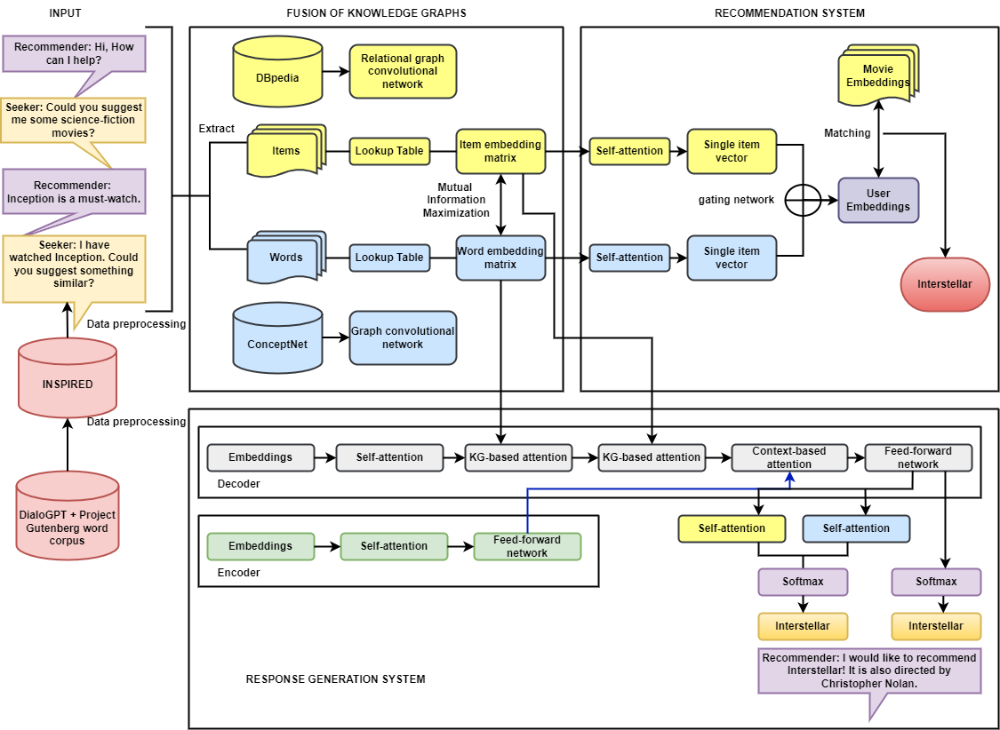

#Improving Conversational Recommender Systems via Knowledge Graph based Semantic Fusion with historical interaction data

The goal of conversational recommender systems (CRS) is to make appropriate recommendations through interactive conversation. To do this, CRS must first understand user preferences from previous conversations before making recommendations and eliciting answers.

#


# Environment
pytorch==1.11.0

# Notation
The word embedding file **word2vec_inspired.npy** can be produced by the following function dataset.prepare_word2vec(), or directly download from the google drive
https://drive.google.com/file/d/135_vUYLBBomTaqgtX6kmgCoQwvatQmEi/view?usp=sharing

You can find the file **kg.pkl** from the link https://drive.google.com/file/d/1WyNaJSoIYo6EwnKLkUqrCooTiISWLSrN/view?usp=sharing and the **pre-trained model** from the link https://drive.google.com/file/d/1GFirkUyzA85WTBOmEyX_PaR36rKUtLNs/view?usp=sharing. 

# Training
This model is trained by two steps, you should run the following code to learn the recommendation task.

```python run.py```

Then you can run the following code to learn the conversation task. 

```python run.py --is_finetune True```
